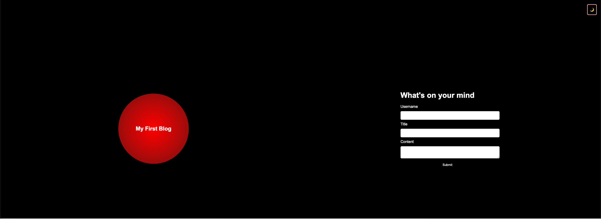
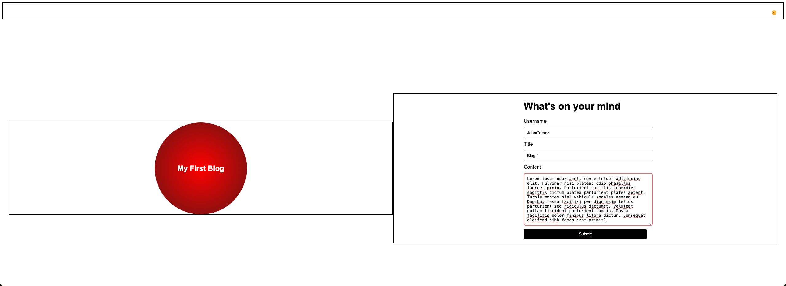
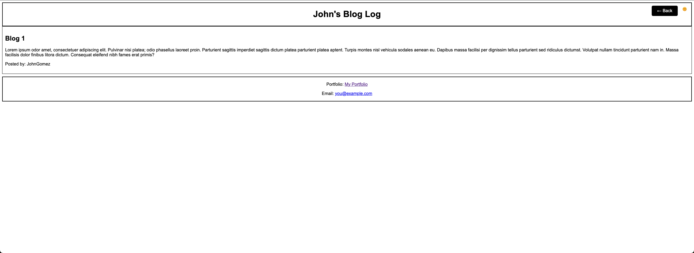
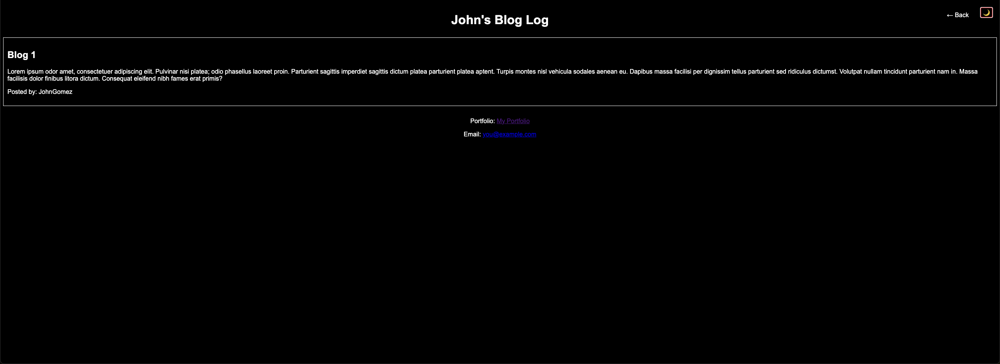
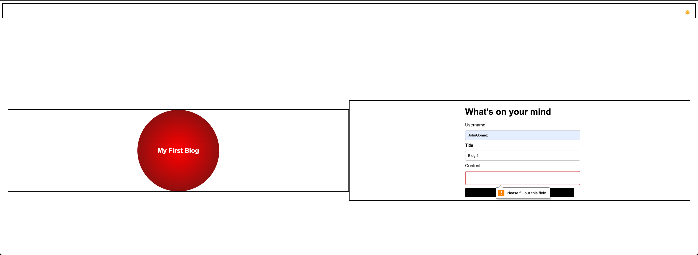
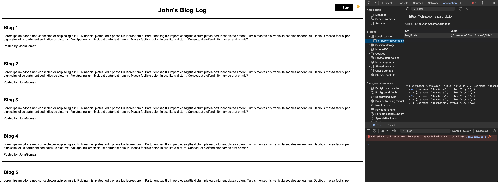
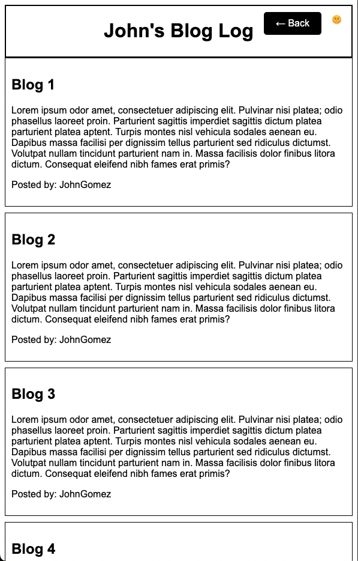

# John Gomez's Personal Blog

## Description
My personal blog application where my friends and I can submit and view blog posts!

## Table of Contents
1. [Installation](#installation)
2. [Usage](#usage)
3. [Features](#features)
4. [Screenshots](#screenshots)
5. [Contributing](#contributing)
6. [License](#license)
7. [Acknowledgments](#acknowledgments)
8. [Contact Information](#contact-information)

## Installation

### Prerequisites
- A web browser (Chrome, Firefox, Safari)
- [Git](https://git-scm.com/)
- [Node.js](https://nodejs.org/)

### Steps
1. Clone the repository:
   ```sh
   git clone git@github.com:johnwgomez/personal-blog-final.git
   ```
2. Navigate to the project directory:
   ```sh
   cd personal-blog-final
   ```
3. Open `index.html` in your browser to view the landing page.

## Usage

### Adding a New Blog Post
1. Open the landing page.
2. Fill out the form with your username, blog title, and blog content.
3. Click the "Submit" button.
4. After successful submission, you will be redirected to the posts page where your new blog post will be displayed.

### Viewing Blog Posts
1. Navigate to the posts page to view all submitted blog posts.
2. Use the light mode/dark mode toggle button to switch between themes.
3. Click the "Back" button to return to the landing page to add more blog posts.

## Features
- **Responsive Design:** Optimized for different screen sizes.
- **Dark Mode:** Toggle between light and dark themes.
- **Local Storage:** Saves and retrieves blog posts from the browser's local storage.
- **User-Friendly Interface:** Simple and intuitive design.

## Screenshots

### Landing Page


### Landing Page Dark


### Landing Page User Interaction


### Blog Page Submit


### Blog Page Dark


### Landing Page Blank Field


### Local Storage


### Mobile


## Contributing
Contributions are welcome! Please follow these steps:
1. Fork the repository.
2. Create a new branch (`git checkout -b feature/newfeature`).
3. Commit your changes (`git commit -m 'Add some newfeature'`).
4. Push to the branch (`git push origin feature/newfeature`).
5. Open a pull request.

## License
free to use JohnGomez

## Acknowledgments
- [MDN Web Docs](https://developer.mozilla.org/)
- [W3Schools](https://www.w3schools.com/)

## Contact Information
- **John Gomez**
- [Portfolio](https://github.com/johnwgomez?tab=repositories)
- [Email](mailto:john@example.com)
